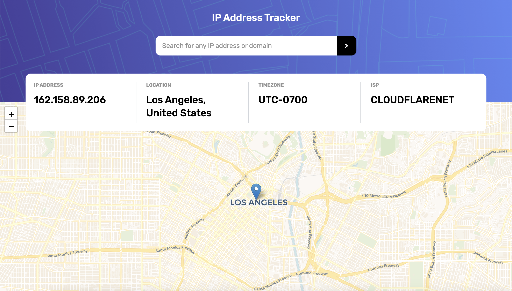

# PingPoint

Find and display location information based on entered IP. Built with a clean UI and responsive layout using React, Vite, and Tailwind CSS.

## 🚀 Live Demo

Check it out here: _Not available yet_

## ✨ Features

- 🔎 IP address geolocation (city, country, timezone, ISP)
- 🗺️ Interactive map powered by Leaflet
- 🌐 Fully responsive and mobile-friendly
- ⚡ Built with **React**, **Vite**, and **Tailwind CSS**

## 📸 Screenshot



## 💡 Getting Started

### 1. Clone the repo

```bash
git clone https://github.com/Sereyvidya/PingPoint
cd PingPoint
```

### 2. Install dependencies

```bash
npm install
```

### 3. Run the development server

```bash
npm run dev
```

App will be running at: `http://localhost:5173`

## 🛠 Tech Stack

- ⚛️ React
- ⚡ Vite
- 🎨 Tailwind CSS
- 🌍 [ipapi.co](https://ipapi.co/)
- 🗺️ Leaflet & React Leaflet

## 📁 Folder Structure

```bash
├── public/
│   ├── desktopBg.png
│   └── mobileBg.png
├── src/
│   ├── components/
│   │   ├── Display.jsx
│   │   ├── Header.jsx
│   │   └── Location.jsx
│   ├── App.jsx
│   └── index.css
├── index.html
└── package.json
```

## 🙌 Credits

- Inspired by the [IP Address Tracker](https://www.frontendmentor.io/challenges/ip-address-tracker-I8-0yYAH0) challenge from Frontend Mentor.

## 🪪 License

MIT — free to use, remix, and build upon!
